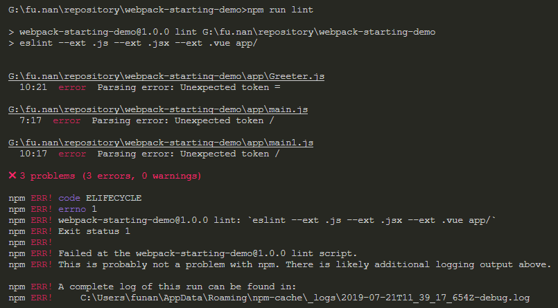

# ESLint

可组装的 JavaScript 和 JSX 代码检测工具

> ESLint 最初是由 Nicholas C. Zakas 于 2013 年 6 月创建的开源项目。它的目标是提供一个插件化的 javascript 代码检测工具。

## 背景

由于在项目中增加了*eslint*语法检查，而且对于*eslint 规则*比较陌生，因此代码中常常报错，一行代码报仨错真的不仅仅是个笑话，借此机会，本文主旨是*eslint 规则*的整理，对于*eslint*的底层实现仅做简单介绍。

## 简介

ESLint 是目前最流行、最常用的 JS 代码检测工具，支持 ES6、JSX，有数百种检测规则，高度可配置，是规范化不可缺少的工具。

## 安装

```bash
# 全局安装
npm install eslint -g
# 局部安装
npm install eslint --save-dev
```

## CLI

文档地址：[eslint CLI](https://cn.eslint.org/docs/user-guide/command-line-interface)

```bash
# 基本格式
eslint [options] [file/dir/glob]*
# 查看帮助信息
eslint -h
# 初始化
./node-modules/.bin/eslint --init
# 或，使用npx
npx eslint --init
# 检查指定文件
./node-modules/.bin/eslint yourfile.js
# 或，使用npx
npx eslint eslint yourfile.js
```

输出结果如下图（vscode 终端）：

3 个 error，0 个 warning，退出码为 1

> 关于退出码：0，无错误；1，有错误；2，eslint 执行出错，npm bug 或者配置文件不对

实际开发中较少使用 ESLint CLI，更多的使用配置文件搭配 VSCode，[详见](./src/tools/eslint-vscode.md)。

## 配置

- .eslintrc.js（或 package.json 文件的*eslintConfig*字段）: 配置
- .eslintignore: ignore 文件

例：

```json
{
  "rules": {
    "semi": ["error", "always"],
    "quotes": ["error", "double"]
  }
}
```

- “off”或 0： 关闭规则
- “warning”或 1： 警告（不影响退出码）
- “error”或 2：错误（退出码为 1）

加入下面一行配置表示默认开启[规则](https://cn.eslint.org/docs/rules/)中所有标记的规则，也可以在[npm](https://www.npmjs.com/search?q=eslint-config)搜索*eslint-config*使用别人创建好的配置

```json
"extends": "eslint:recommended"
```

## 规则

[规则](/src/tools/eslint-basic.md)

如何禁用：  
在代码中使用如下格式的注释

```javascript
// 全文件禁用
/* eslint-disable */
```

## 预设

预设是规则的集合，所有规则都是基本规则中的

- [airbnb](/src/tools/eslint-preset-airbnb.md)

## 插件

插件是扩展规则的集合

- [eslint-plugin-react](/src/tools/eslint-plugin-react.md)
- [eslint-plugin-jsx-a11y](/src/tools/eslint-plugin-jsx-a11y.md)
- [eslint-plugin-import](/src/tools/eslint-plugin-import.md)

## 参考文档

1. [ESLint 中文网](https://cn.eslint.org/)
