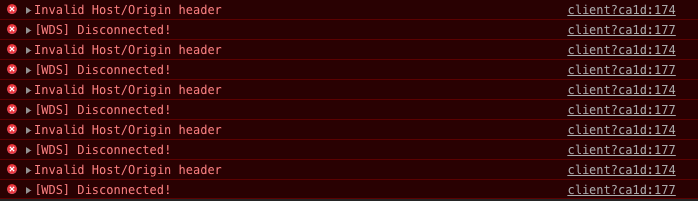

# webpack

version: 4.23.1

## Webpack 入门

### Webpack 简介

### 安装

全局安装

```bash
npm install webpack -g
```

本地安装

```bash
npm install webpack --save-dev
```

## 核心概念

entry

output

loader

plugins

## 配置

默认配置文件: webpack.config.js
指定配置文件: webpack --config webpack.config.js

- entry
- output
  - path
  - filename
- module
  - rules
- plugins
- devtool
- devServer
  - contentBase
  - port
  - historyApiFallback
  - inline
- resolve
  - extensions
  - alias
- externals
- node

## 常用 loader

1. css-loader
1. style-loader

## 常用插件

1. [webpack.DefinePlugin](./webpack-plugins.md#define-plugin): 设置不同环境的全局变量
1. [webpack.optimize.ModuleConcatenationPlugin](./webpack-plugins.md#module-concatenation-plugin): 提升模块化性能
1. [webpack.optimize.CommonsChunkPlugin](./webpack-plugins.md#commons-chunk-plugin): 处理公共模块
1. [webpack.HotModuleReplacementPlugin](./webpack-plugins.md#hot-module-replacement-plugin): 热替换, 开发环境启用
1. [webpack.DllReferencePlugin](./webpack-plugins.md#dll-reference-plugin): 仅打包非第三方库代码
1. [html-webpack-plugin](./webpack-plugins.md#html-webpack-plugin): 生成 HTML 文件
1. [copy-webpack-plugin](./webpack-plugins.md#copy-webpack-plugin): 拷贝文件或目录
1. [clean-webpack-plugin](./webpack-plugins.md#clean-webpack-plugin): 清除文件或目录
1. [extract-text-webpack-plugin](./webpack-plugins.md#extract-text-webpack-plugin): 提取 CSS 到 `.css` 文件中
1. [open-browser-webpack-plugin](./webpack-plugins.md#open-browser-webpack-plugin): 打开浏览器, 开发环境启用
1. [progress-bar-webpack-plugin](./webpack-plugins.md#progress-bar-webpack-plugin): 打包时显示进度条
1. [HappyPack](./webpack-plugins.md#happy-pack): 多进程处理打包过程
1. [webpack-parallel-uglify-plugin](./webpack-plugins.md#webpack-parallel-uglify-plugin): 多进程压缩代码
1. [uglifyjs-webpack-plugin](./webpack-plugins.md#uglifyjs-webpack-plugin): 

## 打包脚本

1. webpack
1. webpack-dev-server

## 常见问题

1. webpack 常见任务
1. webpack 优化, 打包速度和大小
1. 如何打包多页面
1. 如何实现代码分隔
1. 如何实现热更新
1. 如何构建不同环境下的打包配置
    - 开发环境 dev
    - 测试环境 test
    - 验收环境 stage
    - 生产环境 prod
1. 如何在 nodejs 中使用 webpack
1. 执行 npm run server, 控制台不断打印 client?ca1d:174 Invalid Host/Origin header
    
    配置中设置 devServer.disableHostCheck 为 true

## 参考链接

1. [webpack 中文文档](https://www.webpackjs.com/)
1. [看完你就会用 webpack 了](https://juejin.im/post/5f14f886f265da2306247f7b)
1. [webpack入门看他就够了！！](https://juejin.im/post/6844903958993960973)
1. [webpack配置（第五步：less/css篇（基础篇））](https://my.oschina.net/u/3797834/blog/1649270)
1. [【解决方案】webpack `Invalid Host/Origin header`问题](https://blog.csdn.net/u013243347/article/details/85223016)
